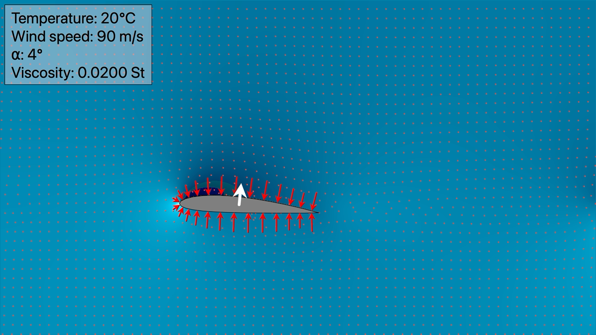

# DMCLatticeBoltzmann

This is a swift implementation of a D2Q9 Lattice-Boltzmann fluid flow simulation.

This package defines three products.

The `DMCLatticeBoltzmann` library models the flow of large collections of particles in a 2-dimensional space.

The `DMCLatticeBoltzmannRender` library creates QuickTime movies showing how the simulation evolves over time.

The `DMCLatticeBoltzmannSim` command line executable shows how these libraries can be used to run and record a simulation.

*`DMC` is meant to reduce the likelihood of name collisions with other Swift packages.  It's short for "[Desert Moon Consulting](https://dmoonc.com)," my software consulting LLC.*

## Motivation

After modeling fluid flow in terms of [simple particle interactions](https://github.com/mchapman87501/DMCWingWorks.git) I wondered whether I could learn enough about Boltzmann's kinetic theory of gases to model fluid flow in terms of the statistical behavior of large numbers of particles.

Who am I kidding?  Of course I couldn't.  But I did almost immediately trip across Lattice Boltzmann modeling techniques.

The only time I'd tried to learn about computational fluid dynamics, in the early 1990s, I'd been overwhelmed by Navier Stokes equations, methods for building complex 3D meshes, and so on.  In addition to being hard for me to understand, it all seemed too far abstracted from gas particles to provide any satisfactory understanding.

Given that, it was a thrill to discover that people *had* been building computational models of fluid flow in terms of Boltzmann's kinetic theory for decades.  The Lattice Boltzmann approach uses a version of Boltzmann's equation to model the properties of gas flowing through a lattice of discrete points in space, across discrete steps in time.  I don't really understand Boltzmann's equation, but the rest of the approach makes good sense.

## Sources

This code draws heavily on the following sources.

https://softologyblog.wordpress.com/2017/03/28/more-fun-with-lattice-boltzman-method-lbm-fluid-simulations/

https://physics.weber.edu/schroeder/fluids/ and its links, including:

* https://physics.weber.edu/schroeder/fluids/FluidSimulationsForUndergrads.pdf
* http://physics.weber.edu/schroeder/javacourse/LatticeBoltzmann.pdf
* https://physics.weber.edu/schroeder/fluids/LatticeBoltzmannDemo.java.txt

https://homepages.abdn.ac.uk/jderksen/pages/lbm/ln02_lb.pdf

